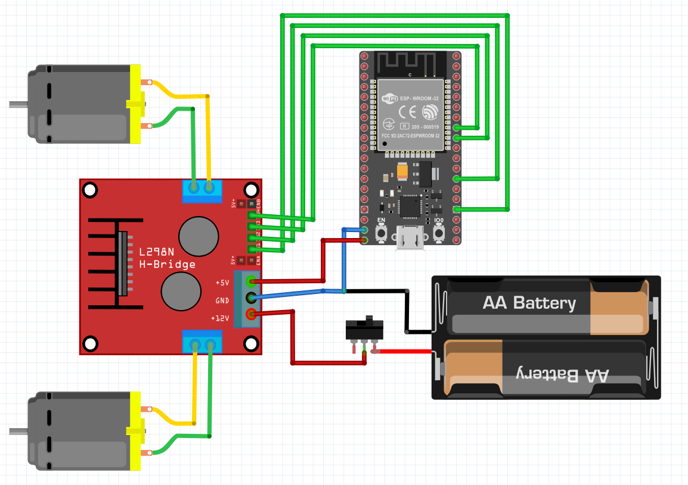
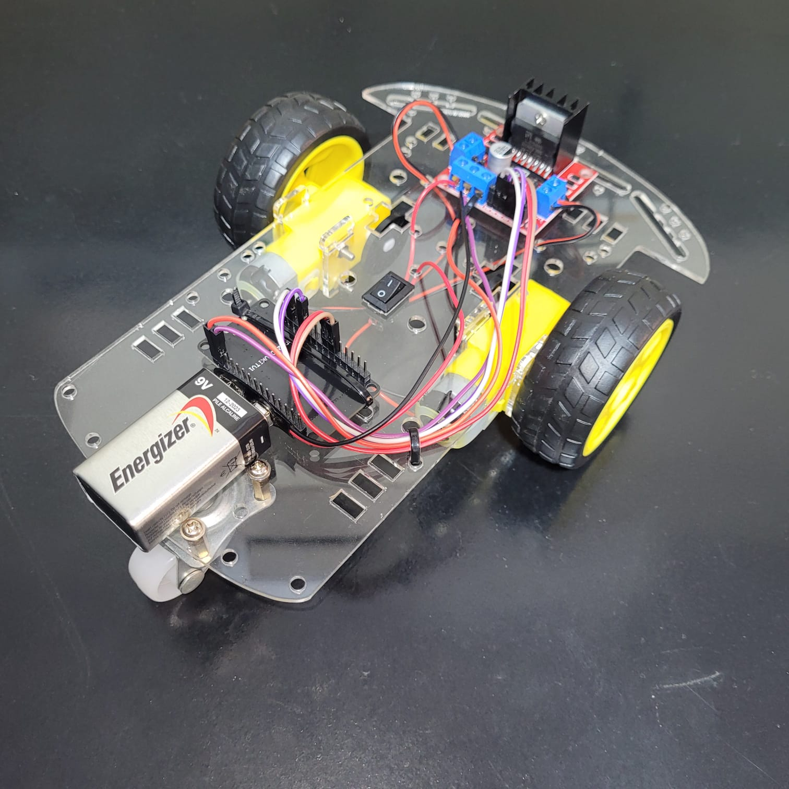

# Robô Wifi para ESP32

O wifi manager é baseado no código:
https://randomnerdtutorials.com/esp8266-nodemcu-wi-fi-manager-asyncwebserver/  
 
O joystick é baseado no código:
https://www.instructables.com/Making-a-Joystick-With-HTML-pure-JavaScript/

## Lista de materiais
- ESP32
- Ponte H (arduino)
- Conectores fêmea-fêmea de protoboard (pelo menos 6)
- Bateria 9V
- Chassi de carrinho arduino
    - 2 motores DC
    - Caixa redutora
    - 2 Rodinhas
    - Chassi de acrílico
    - Chave gangorra

## Esquemático

## Robô montado
